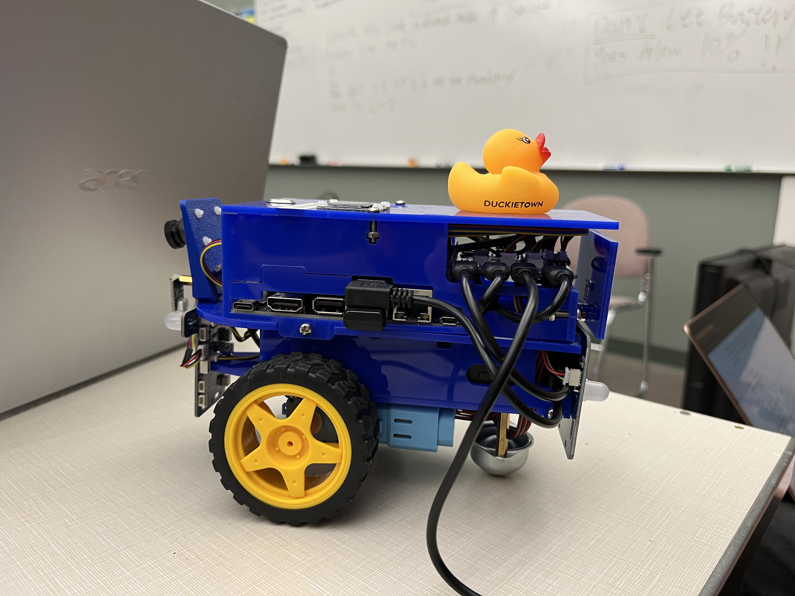
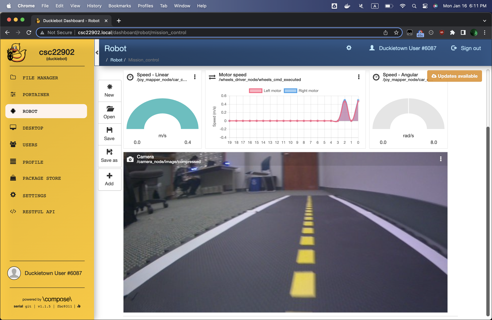
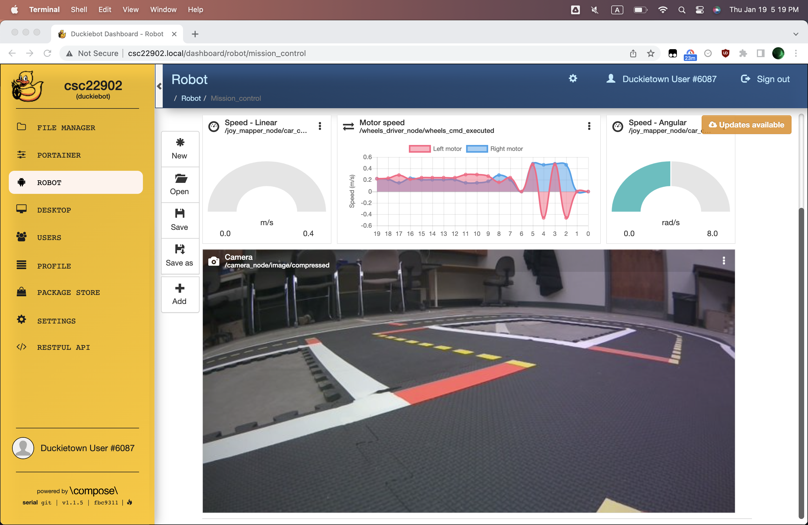

# Exercise 1 - Duckiebot Assembly and Basic Development

## My Duckiebot



## Demos

### Straight Line Demo

<iframe width="100%" height="315" src="https://www.youtube.com/embed/XhuX9_fkPuY" title="YouTube video player" frameborder="0" allow="accelerometer; autoplay; clipboard-write; encrypted-media; gyroscope; picture-in-picture; web-share" allowfullscreen></iframe>

Even after lots of wheel trim calibration, we see that the Duckiebot still does not travel in a perfectly straight line. This is because in the real world, many of assumptions we make in class do not hold and there are many variables that affect the drift besides trim. For example, the fact that the wheels aren't point contacts, there is friction, and uneven surfaces all can result in the drifting behavior. However, after calibration the Duckiebot drifts by less than 10 cm in a 2 m run, which the Duckumentation states is sufficient for Duckietown.

### Dashboard



The dashboard can readily display the camera output and motor signals from a
Duckiebot.

### Lane Following Demo

<iframe width="100%" height="315" src="https://www.youtube.com/embed/Fs1bxWm-WQ0" title="YouTube video player" frameborder="0" allow="accelerometer; autoplay; clipboard-write; encrypted-media; gyroscope; picture-in-picture; web-share" allowfullscreen></iframe>

In my first attempt, my Duckiebot constantly drove on to the white lines. However,
after recalibration, the lane following demo worked pretty well suggesting that
good camera and wheel calibration is important for lane following performance.

## Write Up

### Implemented

* A hello from Duckiebot Docker container.
* A color detector Docker container.

[Exercise 1 Code Implementation](https://github.com/steventango/cmput-412-labs/tree/main/exercise-1)

### Learned

I learned the basic knowledge and skills necessary to operate on Duckiebots. I learned how to do connect to the Duckiebot, camera and wheel calibration, and how to use the Duckietown shell. Additionally, I learned about the complexities of Duckiebot networking, including how to ssh into Duckiebot with `ssh duckie@csc22902.local`, and most importantly how to run Docker commands on a Duckiebot using `docker -H csc22902.local ...`. I also learned to be ready to debug what seemingly worked yesterday, with so many variables at play, things broke often, and I had to quickly find workarounds.

### Challenges

#### **macOS**

A big challenge was dealing with the fact that there is no way to dual boot
Ubuntu onto a M2 Macbook. I attempted a native macOS install of `dts`, a Ubuntu Docker container, but both were quite buggy.

Later, I found that a nice option is to use create an
Ubuntu 20.04.5 VM using [UTM](https://mac.getutm.app/). It was difficult to find an Ubuntu 20.04.5 ARM image,but eventually I found one available [here](https://cdimage.ubuntu.com/focal/daily-live/current/). I only ran into a few challenges with the Ubuntu VM, mostly due to using the ARM architecture image.

Firstly, I couldn't install Docker Desktop, so
I had to [install Docker using the repository](https://docs.docker.com/engine/install/ubuntu/#install-using-the-repository).

Some `dts` dependencies were broken, and I had to manually update the `pip` and
`requests` packages.

Overall, this VM seems to be fairly reliable for `dts` commands,
except commands that are hardcoded to rely on docker images that require AMD64
architecture like `dts duckiebot calibrate_intrinsics`. Considering this, it
may be worth it in the future to take the performance hit and create a VM that
emulates the AMD64 architecture.

I found a nice [tutorial](https://medium.com/@lizrice/linux-vms-on-an-m1-based-mac-with-vscode-and-utm-d73e7cb06133) for accessing
a Ubuntu VM through VS Code on the host machine. This is extremely useful to
reduce context switching between the Ubuntu VM and the macOS.
The tutorial was not very explicit on a few steps, which I clarify here.
To install OpenSSH server use `sudo apt-get install openssh-server`.
To enable port forwarding, edit the VM's Network setting in UTM to use Emulated
VLAN for Network Type.

#### **mDNS**

For unknown reasons, mDNS on the DuckieNet lab network stopped working for a few days.
This made connecting to the Duckiebot's challenging,
as `dts fleet discover` and a few other `dts` commands
don't work without mDNS. The best workaround I found for this issue is to add
a new entry to my `/etc/hosts` file. Adding `192.168.1.33 csc22902.local`,
effectively allows requests to `csc22902.local` to map to IP address
`192.168.1.33`, allowing me to work past the mDNS issues. To get the IP address, I used SSH to access the lab machine and ran `ping csc22902.local`. Alternatively, `nmap` might also work.

#### **Color Detector**

I found that the [color detector exercise](https://docs.duckietown.org/daffy/duckietown-robotics-development/out/creating_docker_containers.html#sub:autoid-8c0b6f84-4) in the Duckumentation is outdated. I discovered that the `gst_pipeline` string in function template provided for Duckiebot MOOC Founder’s Edition is missing the `{}` necessary for format strings to work properly. However, even after putting the `{}` back it still did not work.

I spent a considerable amount of time looking into workarounds. I looked into
the [camera driver source code](https://github.com/duckietown/dt-duckiebot-interface/blob/daffy/packages/camera_driver/src/jetson_nano_camera_node.py), I tried
copying the `gst_pipeline` into my code but it also didn't work. From [this forum discussion](https://forums.developer.nvidia.com/t/building-a-gstreamer-pipeline/157668/4), Honey_Patouceul suggests using the `gst-launch-1.0` program to validate a GStreamer pipeline. For example,
`gst-launch-1.0 nvarguscamerasrc ! queue ! nvjpegenc ! queue ! appsink`,
outputted that `nvarguscamerasrc ! queue ! nvjpegenc ! queue ! appsink`
was a valid GStreamer pipeline. However, when I used the same pipeline in OpenCV Python
it still did not work.

The Duckumentation notes that if another process is using the camera, your code will not work, to eliminate this as a possibility, I used Portainer
to stop all the containers except `colordetector` and `portainer`.
The code still did not work. I also tried running the `colordetector`
container in a way more similar to how the `dt-duckiebot-interface` was started,
but also to no avail.

If this wasn't an exercise focused on creating a Docker image,
it would be much simpler to use [duckietown/template-ros](https://github.com/duckietown/template-ros) repository and subscribe to the ROS `/csc22902/camera_node/image/compressed` topic instead of reverse engineering the camera driver and `dt-duckiebot-interface` container. While I couldn't quite get the `gst_pipeline` working, I was able to learn a lot about how the Duckietown Docker containers work and the complexities of the drivers that act as an interface between hardware and software. Regardless, I was able to successfully build and push my `colordetector` Docker image to [DockerHub](https://hub.docker.com/r/steventango/colordetector).

#### **Duckietown Python Library**

When running `make docker test`, `pipdeptree` raised an exception,

```bash
Step 8/11 : RUN pipdeptree
 ---> Running in 47b0acca7829
Traceback (most recent call last):
  File "/usr/local/lib/python3.7/site-packages/pipdeptree.py", line 17, in <module>
    from pip._internal.utils.misc import get_installed_distributions
ImportError: cannot import name 'get_installed_distributions' from 'pip._internal.utils.misc' (/usr/local/lib/python3.7/site-packages/pip/_internal/utils/misc.py)

During handling of the above exception, another exception occurred:

Traceback (most recent call last):
  File "/usr/local/bin/pipdeptree", line 5, in <module>
    from pipdeptree import main
  File "/usr/local/lib/python3.7/site-packages/pipdeptree.py", line 20, in <module>
    from pip import get_installed_distributions, FrozenRequirement
ImportError: cannot import name 'get_installed_distributions' from 'pip' (/usr/local/lib/python3.7/site-packages/pip/__init__.py)
The command '/bin/sh -c pipdeptree' returned a non-zero code: 1
make: *** [Makefile:66: build] Error 1
```

I had to revert `pip` to `21.2.4` to in the `Dockerfile` to resolve this.

```Dockerfile
RUN python3 -m pip install pip==21.2.4
```
