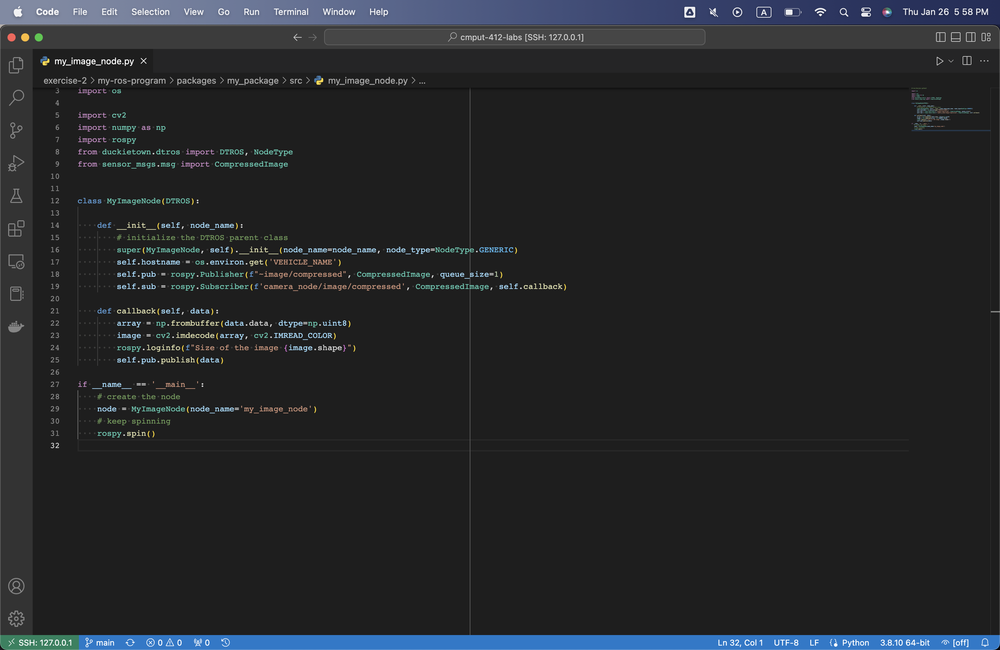

# Exercise 2 - ROS Development and Kinematics


## Learnings

### [ROS Concepts](http://wiki.ros.org/ROS/Concepts)

* Node: named modular computation process.
* Topic: named message bus that routes messages that nodes can publish and subscribe to.
* Service: named pair of request message from a client node and reply message from the providing node.
* Message: typed data structure used for internode communication.
* Bag: message data format

`sudo nmap -sS -v -n -p 22 192.168.1.33/24 --host-timeout 1 --max-retries 1 --min-parallelism 256 --min-rtt-timeout 1 --max-rtt-timeout 1 --initial-rtt-timeout 1`

Write your code to store your robot's hostname in a variable

```py
hostname = os.environ.get('VEHICLE_NAME')
```

Using `rqt_image_view` to view the camera image in my customized topic /`csc22902/`


Screenshot of code for Part One Question 2


## Challenges

### dts

I found that the `dts devel build -f -H csc22902.local` command failed intermittently with the following error:
```bash
docker.errors.APIError: 500 Server Error for http://192.168.1.33:2375/v1.40/auth: Internal Server Error ("Get https://registry-1.docker.io/v2/: net/http: request canceled while waiting for connection (Client.Timeout exceeded while awaiting headers)")
```

I found that this docker command modified from [RH2 Unit B-5.4-E17](https://docs.duckietown.org/daffy/duckietown-robotics-development/out/creating_docker_containers.html) is equivalent

```bash
docker -H csc22902.local build -t duckietown/my-ros-program:latest-arm64v8 .
```

Similarly for `dts devel run -H csc22902.local`, we can use

```bash
docker -H csc22902.local run -it duckietown/my-ros-program:latest-arm64v8
```
